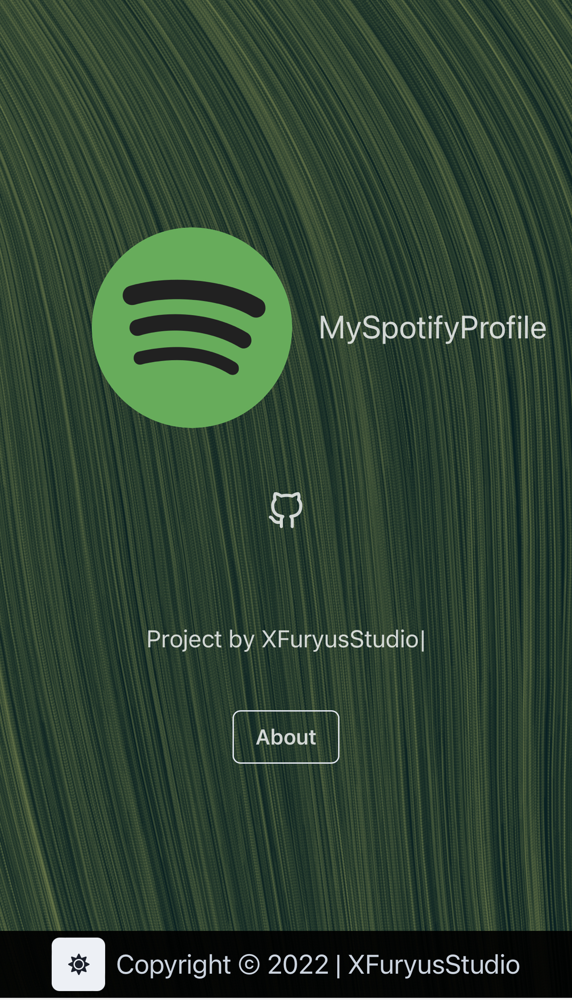

# Welcome!
Show your spotify profile, your currently playing song and last song

• Example link: myspoty.ga/yourname

# Screenshots

- Landing page


- Example page


# How to get a Spotify profile page

- Send us an email filling the template:<br>
• <a href="mailto:myspotifyprofile@xfuryus.ga?subject=Requesting%20spotify%20page&body=SPOTIFY%20PROFILE%20USERNAME%3A%20%3Cusername%3E%0D%0ASPOTIFY%20CLIENT%20ID%3A%20%3Cid%3E%0D%0ASPOTIFY%20CLIENT%20SECRET%3A%20%3Cclientsecret%3E%0D%0ASPOTIFY%20REFRESH%20TOKEN%3A%20%3Crefreshtoken%3E%0D%0ASPOTIFY%20FAVORITE%20PLAYLIST%3A%20%3Clink%3E">Request page now</a>
<br>• You will receive an email when the page has been deployed.

- Example template
```HTML
SPOTIFY PROFILE USERNAME: <username>
SPOTIFY CLIENT ID: <id>
SPOTIFY CLIENT SECRET: <clientsecret>
SPOTIFY REFRESH TOKEN: <refreshtoken>
SPOTIFY FAVORITE PLAYLIST: <link>
```

# How to obtain your profile username:
- https://www.businessinsider.com/how-to-find-spotify-username?amp
# How to obtain your client id:
- https://developer.spotify.com/documentation/general/guides/authorization/app-settings/
# How to obtain your client secret:
- https://developer.spotify.com/documentation/general/guides/authorization/app-settings/
# How to generate your refresh token:
- https://alecchendev.medium.com/get-your-spotify-refresh-token-with-this-simple-web-app-d942dad05847
<br>• Tick the following permissions: `user-read-recently-played` `user-read-currently-playing`

# Need help? Open a GitHub Discussion.
